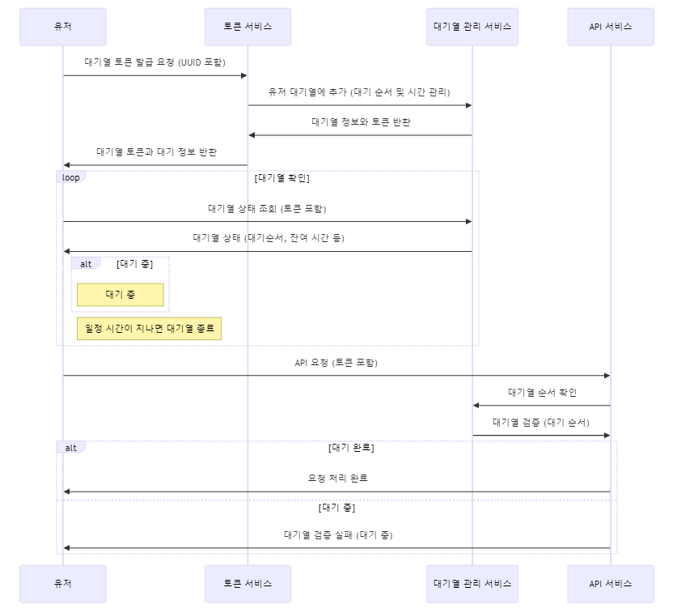
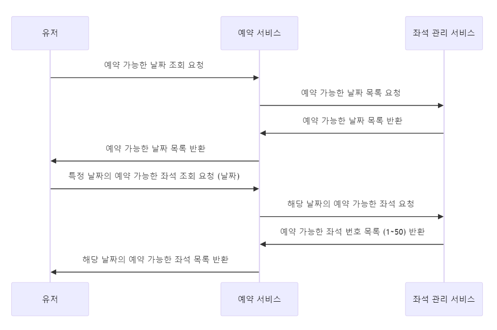
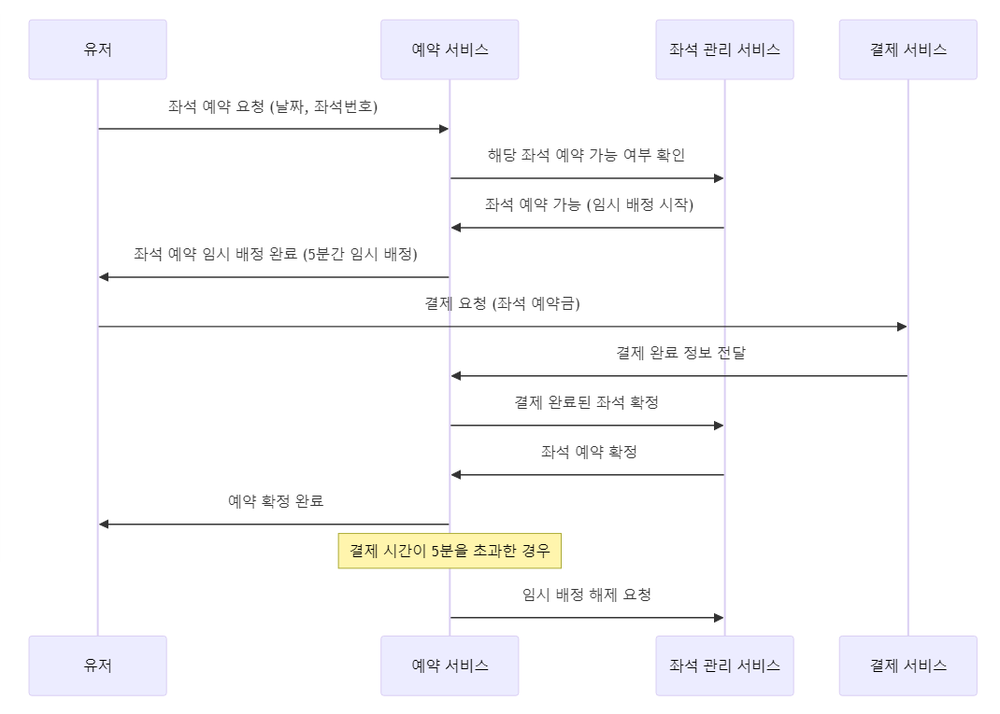
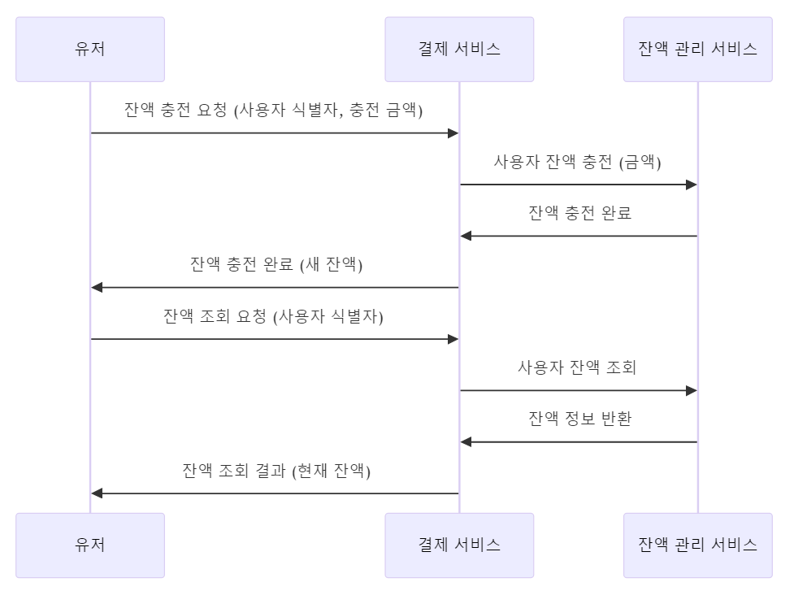
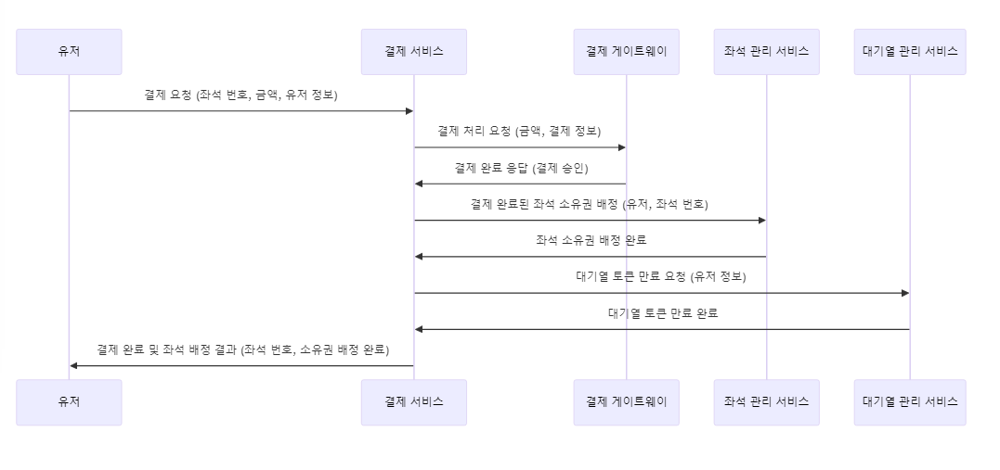
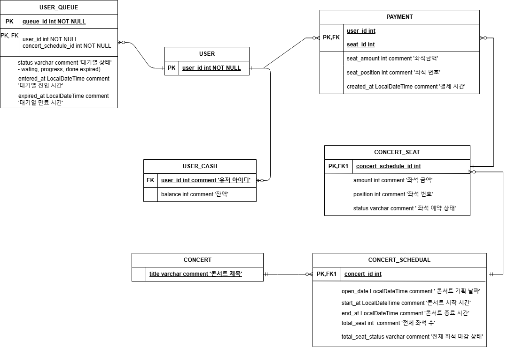

# **필수 사항**

- **콘서트 예약 서비스**를 구현해 봅니다.
- 대기열 시스템을 구축하고, 예약 서비스는 작업가능한 유저만 수행할 수 있도록 해야합니다.
- 사용자는 좌석예약 시에 미리 충전한 잔액을 이용합니다.
- 좌석 예약 요청시에, 결제가 이루어지지 않더라도 일정 시간동안 다른 유저가 해당 좌석에 접근할 수 없도록 합니다.

## [과제] 콘서트 예약 서비스
- 아래 5가지 API 를 구현합니다.
    - 유저 토큰 발급 API
    - 예약 가능 날짜 / 좌석 API
    - 좌석 예약 요청 API
    - 잔액 충전 / 조회 API
    - 결제 API
- 각 기능 및 제약사항에 대해 단위 테스트를 반드시 하나 이상 작성하도록 합니다.
- 다수의 인스턴스로 어플리케이션이 동작하더라도 기능에 문제가 없도록 작성하도록 합니다.
- 동시성 이슈를 고려하여 구현합니다.
- 대기열 개념을 고려해 구현합니다.

## [커밋 링크]
### 1. 요구사항 분석 
[commit Requirements.md](https://github.com/bin081/hanghae/commit/0c5d3986ec8f8aa9a20aeafc98b630ecb49ef3a2)

### 2. 시퀀스 다이어그램
#### 2-1. 유저 토큰 발급 API

#### 2-2. 예약 가능 날짜 / 좌석 API

#### 2-3. 좌석 예약 요청 API

#### 2-4. 잔액 충전 / 조회 API

#### 2-5. 결제 API

### 3. ERD 설계 

### 4. API Spec 

### 5. 마일스톤 
[commit milestone.md](https://github.com/bin081/hanghae/commit/0b28ded1f9cea35c7a20f7d91687691e1793e51a)

### 6. Mock API 
[mock api commit](https://github.com/bin081/hanghae/commit/67d85e1)

## **리뷰포인트**

### **이번주 KPT 회고**
### Keep
<!-- 유지해야 할 좋은 점 -->
### Problem
<!--개선이 필요한 점-->
### Try
<!-- 새롭게 시도할 점 -->
